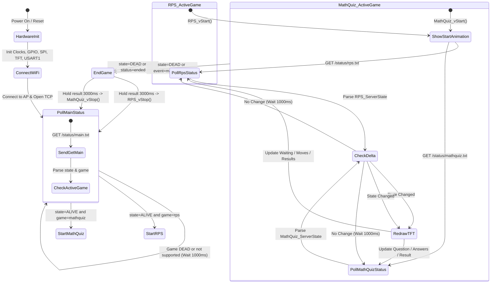

# STM32F401CC IoT Game Monitor: Rock-Paper-Scissors

A connected embedded systems project for the **STM32F401CC** (ARM Cortex-M4) microcontroller. The STM32 functions as a **dedicated, passive physical display monitor** for an online multiplayer Rock-Paper-Scissors game.

The system connects to a remote web server via an **ESP8266 Wi-Fi module** (using AT commands over USART), continuously polls the match state, and renders real-time game status, custom pixel art, vector animations, and results on a **1.8" 128x160 SPI TFT display** (ST7735).

---

## Table of Contents
1. [Project Overview](#project-overview)
2. [High-Level Architecture](#high-level-architecture)
3. [Hardware Specifications & Pin Mapping](#hardware-specifications--pin-mapping)
4. [Communication Protocol & Data Format](#communication-protocol--data-format)
5. [Firmware Architecture (STM32F401CC)](#firmware-architecture-stm32f401cc)
   - [MCAL (Microcontroller Abstraction Layer)](#mcal-microcontroller-abstraction-layer)
   - [HAL (Hardware Abstraction Layer)](#hal-hardware-abstraction-layer)
   - [APP (Application Layer)](#app-application-layer)
6. [Website & Backend (`website/Projecth`)](#website--backend-websiteprojecth)
7. [Operational Flow & State Machine](#operational-flow--state-machine)
8. [Project File Structure](#project-file-structure)
9. [Setup, Build & Deployment Guide](#setup-build--deployment-guide)

---

## Project Overview

In this project, human players interact through a web application on their browsers (smartphones or PCs). The web server manages game rooms, tracks player moves, and evaluates outcomes.

The **STM32F401CC** does not act as an input controller; rather, it serves as an **IoT Spectator / Passive Monitor**:
- It runs an embedded HTTP client stack over an ESP8266 Wi-Fi co-processor.
- It polls the web backend for active game status.
- Once a game is active (`ALIVE` state), it tracks player choices, round progression, and winning outcomes.
- It translates network state events into graphics and animations rendered directly to a 128x160 TFT display.
- Currently, the **Rock-Paper-Scissors (RPS)** game is fully implemented and integrated across the hardware and software stack.

```
+------------------+         +------------------+
|  Web Player 1    |         |   Web Player 2   |
| (Browser/Mobile) |         | (Browser/Mobile) |
+--------+---------+         +--------+---------+
         |                            |
         | HTTP POST/GET (JSON)       | HTTP POST/GET (JSON)
         +------------+  +------------+
                      v  v
            +----------------------+
            |  PHP Backend Server  |
            |   (rps_backend.php)  |
            +----------+-----------+
                       |
                       | Writes key=value status
                       v
            +----------------------+
            |  /status/main.txt    |
            |  /status/rps.txt     |
            +----------+-----------+
                       ^
                       | HTTP GET via AT Commands
                       | (Every 1000 ms)
            +----------+-----------+
            |    ESP8266 Module    |
            +----------+-----------+
                       |
                       | USART1 (115200 Baud)
                       v
            +----------------------+
            |  STM32F401CC (MCU)   |
            |   Passive Monitor    |
            +----------+-----------+
                       |
                       | Hardware SPI1 + GPIO
                       v
            +----------------------+
            | 128x160 TFT Display  |
            |  (ST7735 Controller) |
            +----------------------+
```

---

## High-Level Architecture

The architecture decouples game logic and user input from the embedded monitor:

1. **Players & Web UI**:
   - Players create or join rooms via `rps.html` and `rps.js`.
   - Players choose Rock, Paper, or Scissors.
2. **Backend Storage & Slicing**:
   - `rps_backend.php` manages room files (`rooms/<room>.json`) and writes flat `key=value` status files under `status/`.
   - `status_helper.php` maintains a single master status file (`status/main.txt`) that tags the currently active game.
3. **Embedded Monitor (STM32 + ESP8266)**:
   - The STM32 polls `status/main.txt`, detects `state=ALIVE`, then switches to the matching game module.
   - Each game module polls its own `/status/<game>.txt` every 1000 ms, detects state deltas, and redraws the TFT only on change (no flicker).

---

## Hardware Specifications & Pin Mapping

| Module | Connection | STM32F401CC Pin | Details |
| :--- | :--- | :--- | :--- |
| ST7735 TFT (1.8", 128x160) | SPI1 SCK | PA5 (AF5) | SPI clock |
| ST7735 TFT | SPI1 MOSI | PA7 (AF5) | SPI data out |
| ST7735 TFT | Reset | PA0 | Hardware reset pulse on init |
| ESP8266 Wi-Fi | USART1 TX | PA9 (AF7) | TX to module RX |
| ESP8266 Wi-Fi | USART1 RX | PA10 (AF7) | RX from module TX |
| Clock | HSE | — | 25 MHz (`HSE_VALUE=25000000`) |
| USART1 | — | — | 115200 baud, global interrupt position 37 |

> Hardware pin mapping is shared across game modules; only firmware game logic and the TFT rendering differ.
---

## Communication Protocol & Data Format

To keep embedded memory footprints and CPU overhead minimal, the web backend formats real-time states into a lightweight, semicolon-separated key-value protocol.

### 1. Global Status (`/status/main.txt`)
Queried by the STM32 to detect if any supported game is live:
```text
state=ALIVE;game=mathquiz;time=2026-09-16 12:15:00
```
- `state`: `ALIVE` (game session in progress) or `DEAD` (no active game).
- `game`: Game identifier (e.g. `rps`, `mathquiz`, `xo`, `connect4`, `snakeladder`, `yatzy`).

### 2. Game-Specific Status (`/status/rps.txt`)
Queried by the STM32 when `game=rps` is active:
```text
state=ALIVE;game=rps;room=ABC123;event=round_result;status=result;p1_choice=rock;p2_choice=scissors;winner=p1;round=1;time=2026-09-15 12:15:00
```

#### Protocol Fields Reference

| Key | Values | Description |
| :--- | :--- | :--- |
| `state` | `ALIVE`, `DEAD` | Session lifecycle flag |
| `game` | `rps` | Game identifier |
| `room` | `[A-Z0-9]{6}` | 6-character room code |
| `event` | `create_room`, `player_joined`, `player_choice`, `round_result`, `next_round`, `match_ended` | Backend trigger event |
| `status`| `waiting`, `playing`, `result`, `ended` | Current round phase |
| `p1_choice` | `rock`, `paper`, `scissors`, `""` | Player 1 move (blank until submitted) |
| `p2_choice` | `rock`, `paper`, `scissors`, `""` | Player 2 move (blank until submitted) |
| `winner`| `p1`, `p2`, `draw`, `""` | Outcome of the round |
| `round` | Integer (`1`, `2`, ...) | Current round index |
| `time` | `YYYY-MM-DD HH:MM:SS` | Timestamp of state generation |

> Math Quiz exposes the same file style via `/status/mathquiz.txt`; its full field set, game mode, and question/answer representation are documented in `MATHQUIZ_FIRMWARE_NOTES.md`.

---

## Firmware Architecture (STM32F401CC)

The firmware is organized following layered embedded software engineering principles:

```
src/
├── APP/                      # Application layer
│   ├── RockPaperScissors/    # RPS game logic & animations
│   │   ├── Animation/        # TFT vector graphics, sprites & fonts
│   │   │   ├── RPS_Animation.h
│   │   │   └── RPS_Animation_prg.c
│   │   ├── game_int.h
│   │   └── game_prg.c
│   ├── MathQuiz/                # Math Quiz game logic & animations
│   │   ├── Animation/            # TFT graphics & result banners
│   │   │   ├── MathQuiz_Animation.h
│   │   │   └── MathQuiz_Animation_prg.c
│   │   ├── game_int.h
│   │   └── game_prg.c
│   ├── Common/                  # Shared application utilities
│   │   └── FONT3x5.h/.c            # Shared 3x5 font engine
│   └── main.c                # System initialization, scheduler & state machine
├── HAL/                      # Hardware Abstraction Layer
│   ├── ESP8266/              # ESP8266 AT driver & HTTP GET client
│   └── TFT/                  # ST7735 SPI display driver & primitives
├── MCAL/                     # Microcontroller Abstraction Layer
│   ├── GPIO/                 # Pin configuration & alternate functions
│   ├── NVIC/                 # Nested Vectored Interrupt Controller
│   ├── RCC/                  # Reset and Clock Control
│   ├── SPI/                  # Hardware SPI1 Master driver
│   ├── SYSTICK/              # Accurate millisecond delay timer
│   └── USART/                # USART1 driver with ring buffer interrupt queue
└── LIB/                      # Standard data types and bit manipulation macros
```

### MCAL (Microcontroller Abstraction Layer)
- **`MRCC`**: Configures system clocks (HSE) and enables clock gating for `GPIOA`, `USART1` (APB2 bit 4), and `SPI1` (APB2 bit 12).
- **`MGPIO`**: Sets pin directions, output speed, pull-up/down resistors, and assigns Alternate Functions (`AF5` for SPI1, `AF7` for USART1).
- **`MSPI`**: Controls SPI1 in Master mode (8-bit data, Software Slave Management enabled, CPOL=0, CPHA=0). Supports single-byte transceive and bulk buffer transmission (`MSPI_vTransceiveBuffer`) for display fills.
- **`MUSART`**: Configures USART1 at **115200 baud** (oversampling by 16). Features an interrupt-driven RX circular queue (`G_u8RxQueue`, 1024 bytes) to ensure no characters from the ESP8266 are lost during busy display write routines.
- **`MNVIC`**: Enables USART1 global interrupt (Position 37).
- **`MSYSTICK`**: Provides non-blocking and blocking millisecond delays using the ARM SysTick timer.

### HAL (Hardware Abstraction Layer)

#### ESP8266 Wi-Fi Driver (`src/HAL/ESP8266/`)
- **Initialization**: Resets module echo (`ATE0`) and sets station mode (`AT+CWMODE=1`).
- **Connection Management**:
  - `HESP8266_u8ConnectAccessPoint(ssid, password)`: Joins the local Wi-Fi router.
  - `HESP8266_u8OpenTcpConnection(ip, port)`: Connects via single-connection TCP to the HTTP web server.
  - `HESP8266_u8EnsureConnection(...)`: Auto-reconnect routine with configurable retry limits.
- **HTTP GET Processing**:
  - `HESP8266_u8HttpGet(path, body, size)`: Dynamically calculates payload length, sends `AT+CIPSEND=<length>`, waits for the `>` prompt, transmits `GET <path> HTTP/1.1\r\nHost: ...\r\nConnection: close\r\n\r\n`, and captures response lines containing `state=` or `status=`.

#### TFT 128x160 ST7735 Driver (`src/HAL/TFT/`)
- **Initialization Sequence**: Hardware reset pulse on `PA0`, software exit sleep command (`0x11`), 15 ms delay, 16-bit 565 color mode select (`0x3A`, `0x05`), and display ON command (`0x29`).
- **Drawing Primitives**:
  - `HTFT_vSetXPos`, `HTFT_vSetYPos`: Define display update bounding box.
  - `HTFT_vDrawPixel`, `HTFT_vDrawLine`, `HTFT_vDrawCircle`, `HTFT_vFillCircle`, `HTFT_vFillRectangle`, `HTFT_vFillBackgroundColor`.
  - `HTFT_vDrawLoadingSpinner`: Smooth circular multi-phase loading animation for boot/waiting screens.


### APP (Application Layer)

#### Game Manager (`src/APP/RockPaperScissors/`)
- **State Struct (`RPS_ServerState`)**:
  ```c
  typedef struct {
      u8 Alive;
      RPS_Status Status;           // WAITING, PLAYING, RESULT, ENDED
      u8 Round;
      RPS_Choice Player1_Choice;   // NONE, ROCK, PAPER, SCISSORS
      RPS_Choice Player2_Choice;
      RPS_Winner Winner;           // NONE, P1, P2, DRAW
      char Event[20];
      char Room[12];
  } RPS_ServerState;
  ```
- **State Change Detection (`StateChanged`)**: Caches the last rendered state and only executes screen redrawing routines when relevant fields (round, choices, status, winner) change, eliminating display flicker.

#### Rendering & Procedural Graphics (`RPS_Animation_prg.c`)
- **Pixel-Art Icons**:
  - `DrawRock()`: Multi-layer shaded crag with silhouette, shadow, midtone mass, sunlight highlights, dithering, and ground contact shadow.
  - `DrawPaper()`: White sheet with simulated red margin and blue notebook rule lines.
  - `DrawScissors()`: Dual circle red handles, dark grey central pivot, and tapered blades with reflective highlights.
- **Custom Font Engine**:
  - Procedural 3x5 bitmap glyph generator, now shared as `FONT3x5_vDrawText` in `src/APP/Common/` (see "Shared 3x5 Font Engine" below).
  - Dynamic result banners: `"P1 WINS"`, `"P2 WINS"`, `"DRAW"`, along with player move tags (`"P1 ROCK"`, `"P2 SCISSORS"`).

#### Game Manager (`src/APP/MathQuiz/`)
- **State Struct (`MathQuiz_ServerState`)**:
  ```c
  typedef struct {
      u8 Alive;
      MathQuiz_Status Status;          // WAITING, PLAYING, RESULT, ENDED
      u8 Round;
      char Question[16];               // e.g. "12*8" (compact, server-rendered)
      u8 Player1_AnswerIsSet;
      char Player1_Answer[8];
      u8 Player2_AnswerIsSet;
      char Player2_Answer[8];
      MathQuiz_Winner Winner;          // NONE, P1, P2, DRAW
      char Event[20];
      char Room[12];
  } MathQuiz_ServerState;
  ```
- **Polling**: `main.c` dispatches on `game=mathquiz`, polling `/status/mathquiz.txt` every 1000 ms and hooking the ~3000 ms final-result hold on `state=DEAD` / `event=match_ended`.
- **Delta Detection (`StateChanged`)**: Caches the last rendered state and redraws only when status, round, winner, question, answers, event, or room change (no flicker).
- **Local Score Tracking**: the visible status file does not carry running scores, so the firmware increments P1/P2 counts from the per-round `winner` field.

#### Shared 3x5 Font Engine (`src/APP/Common/`)
- `FONT3x5_pu8GetGlyph(char)` / `FONT3x5_vDrawText(...)`: procedural 3x5 bitmap glyphs (digits 0-9, A-Z, operators `+ - * /`), factored out of RPS into a common layer and reused by both games.

---
## Website & Backend (`website/Projecth`)

The `website/Projecth` directory contains the complete web interface and PHP backend for hosting the multiplayer platform.

### Backend Scripts
- **`rps_backend.php`**:
  - Handles AJAX actions: `create`, `join`, `status`, `move`, `next_round`, and `end_game`.
  - Maintains room state files in `website/Projecth/rooms/<room_id>.json`.
  - Calls `write_status_file()` on every state change to update `website/Projecth/status/rps.txt`.
- **`status_helper.php`**:
  - Maintains `website/Projecth/status/main.txt`.
  - Resolves which game has active priority (`ALIVE`) across all implemented game modules.

### Frontend Client
- **`rps.html` & `rps.js`**:
  - Responsive, dark-themed UI built with modern HTML5/CSS3.
  - Features room code generation, shareable links, real-time polling (1s interval), role badges (P1 / P2), move buttons, and round victory displays.

---

## Operational Flow & State Machine


## Project File Structure

```
.
├── Debug/                         # Build artifacts (ELF, HEX, map files, makefiles)
├── include/                       # System and CMSIS include headers
├── ldscripts/                     # Linker scripts for STM32F401CC flash and RAM
├── system/                        # CMSIS device startup and system initialization
├── src/
│   ├── APP/
│   │   ├── HEXPARSER/             # Intel HEX record parser module
│   │   ├── RockPaperScissors/     # Rock Paper Scissors game logic
│   │   │   ├── Animation/         # TFT graphics, primitives, font glyphs
│   │   │   │   ├── RPS_Animation.h
│   │   │   │   └── RPS_Animation_prg.c
│   │   │   ├── game_int.h         # Game states, enums, function declarations
│   │   │   └── game_prg.c         # State delta checking and update routines
│   │   ├── MathQuiz/              # Math Quiz game logic
│   │   │   ├── Animation/         # TFT graphics & result banners
│   │   │   │   ├── MathQuiz_Animation.h
│   │   │   │   └── MathQuiz_Animation_prg.c
│   │   │   ├── game_int.h         # Game states, enums, function declarations
│   │   │   └── game_prg.c         # State delta checking and update routines
│   │   ├── Common/                # Shared application utilities
│   │   │   └── FONT3x5.h/.c       # Shared 3x5 font engine
│   │   └── main.c                 # Main loop, HTTP parsing, Wi-Fi monitor logic
│   ├── HAL/
│   │   ├── ESP8266/               # ESP8266 AT command driver & HTTP client
│   │   │   ├── ESP8266_cfg.h      # Wi-Fi SSID, Password, Server IP & Port
│   │   │   ├── ESP8266_int.h      # Driver API declarations & debug enums
│   │   │   └── ESP8266_prg.c      # AT command engine & ring buffer reader
│   │   └── TFT/                   # ST7735 128x160 SPI Display driver
│   │       ├── TFT_int.h          # TFT API declarations & color constants
│   │       └── TFT_prg.c          # Display commands, primitives, text renderer
│   ├── MCAL/                      # Hardware peripheral drivers
│   │   ├── GPIO/                  # Pin modes, speeds, alternate functions
│   │   ├── NVIC/                  # Interrupt controller configuration
│   │   ├── RCC/                   # System clock and peripheral gating
│   │   ├── SPI/                   # SPI1 Master hardware driver
│   │   ├── SYSTICK/               # Millisecond timer routines
│   │   └── USART/                 # USART1 driver with circular queue
│   └── LIB/                       # Bit manipulation macros and standard types
│       ├── BIT_MATH.h
│       └── STD_TYPES.h
└── website/
│   └── Projecth/
```
---

## Setup, Build & Deployment Guide

### 1. Web Backend Setup
1. Deploy the contents of `website/Projecth/` to a PHP-capable web server (Apache, Nginx, or built-in PHP server):
   ```powershell
   cd "website\Projecth"
   php -S 0.0.0.0:80
   ```
2. Verify that the `status/` and `rooms/` directories have read and write permissions.
3. Access `http://<your-server-ip>/rps.html` from two browser tabs or mobile devices to test multiplayer functionality.

### 2. Wi-Fi & Server Configuration
Open `src/HAL/ESP8266/ESP8266_cfg.h` and update the network credentials and server IP:
```c
#define HESP8266_WIFI_SSID     "Your_WiFi_SSID"
#define HESP8266_WIFI_PASSWORD "Your_WiFi_Password"
#define HESP8266_SERVER_IP     "192.168.1.100"      // IP of your PHP server
#define HESP8266_SERVER_PORT   "80"
```
In `src/HAL/ESP8266/ESP8266_prg.c`, ensure the `Host:` header in `HESP8266_u8HttpGet()` matches your host domain or IP.

### 3. Building & Flashing Firmware
1. Open the project in your IDE (**STM32CubeIDE**, **Keil uVision**, or using standard **arm-none-eabi-gcc** with the provided `Debug/makefile`).
2. Build the project to generate the binary/hex output:
   ```bash
   make all -C Debug
   ```
3. Connect your **ST-Link v2** programmer to the STM32F401CC SWD pins (`SWDIO`, `SWCLK`, `3.3V`, `GND`).
4. Flash the target using ST-Link Utility, STM32CubeProgrammer, or OpenOCD:
   ```bash
   openocd -f interface/stlink.cfg -f target/stm32f4x.cfg -c "program Debug/fixed_project.elf verify reset exit"
   ```

### 4. Running the Complete System
1. Power on the STM32 and ESP8266.
2. The TFT display initializes to black, displays a loading spinner, and checks Wi-Fi connection.
3. On your browser, navigate to `rps.html` and click **Create Room**.
4. Join the room from a second browser window using the 6-character room code.
5. As soon as both players enter choices, the backend generates the outcome and writes to `/status/rps.txt`.
6. Within 1 second, the STM32 fetches the new state, displays the graphical choices of both players, and announces the winner on the TFT screen.# game_hub

